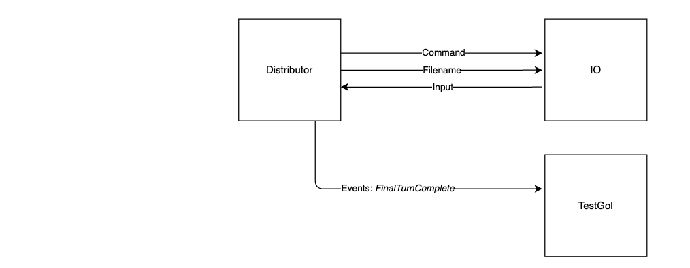

# CSA Coursework: Game of Life

### **Note** : For benchmarking and more in depth information please see [the report](content/report.pdf).

## Task Overview

### Introduction

The British mathematician John Horton Conway devised a cellular automaton named ‘The Game of Life’. The game resides on a 2-valued 2D matrix, i.e. a binary image, where the cells can either be ‘alive’ (pixel value 255 - white) or ‘dead’ (pixel value 0 - black). The game evolution is determined by its initial state and requires no further input. Every cell interacts with its eight neighbour pixels: cells that are horizontally, vertically, or diagonally adjacent. At each matrix update in time the following transitions may occur to create the next evolution of the domain:

- any live cell with fewer than two live neighbours dies
- any live cell with two or three live neighbours is unaffected
- any live cell with more than three live neighbours dies
- any dead cell with exactly three live neighbours becomes alive

Consider the image to be on a closed domain (pixels on the top row are connected to pixels at the bottom row, pixels on the right are connected to pixels on the left and vice versa). A user can only interact with the Game of Life by creating an initial configuration and observing how it evolves. Note that evolving such complex, deterministic systems is an important application of scientific computing, often making use of parallel architectures and concurrent programs running on large computing farms.

The task is to design and implement programs which simulate the Game of Life on an image matrix.

## Stage 1 - Parallel Implementation

In this stage, we evolve the board of Game of Life using multiple worker goroutines on a single machine. 
### Step 1

A single-threaded implementation will serve as a starting point in subsequent steps. The Game of Life will evolve for the number of turns specified in `gol.Params.Turns`. The Game of Life will evolve the correct image specified by  `gol.Params.ImageWidth` and `gol.Params.ImageHeight`.

The Game of Life code will interact with the user or the unit tests using the `events` channel. All events are defined in the file `gol/event.go`. In this step, we are only working with the unit test `TestGol`.

### Step 2

We parallelise Game of Life so that it uses worker threads to calculate the new state of the board. We implement a distributor that tasks different worker threads to operate on different parts of the image in parallel. The number of worker thread that should be created is specified in `gol.Params.Threads`.

### Step 3 and 4 

Using a ticker, we report the number of cells that are still alive *every 2 seconds*. We also implement logic to output the state of the board after all turns have completed as a PGM image.

### Step 5

Implement logic to visualise the state of the game using SDL. 

- If `s` is pressed, this will generate a PGM file with the current state of the board.
- If `q` is pressed, this will generate a PGM file with the current state of the board and then terminate the program. Your program should *not* continue to execute all turns set in `gol.Params.Turns`.
- If `p` is pressed, this will pause the processing and print the current turn that is being processed. If `p` is pressed again resume the processing and print `"Continuing"`. The keys `q` and `s` work while the execution is paused.

