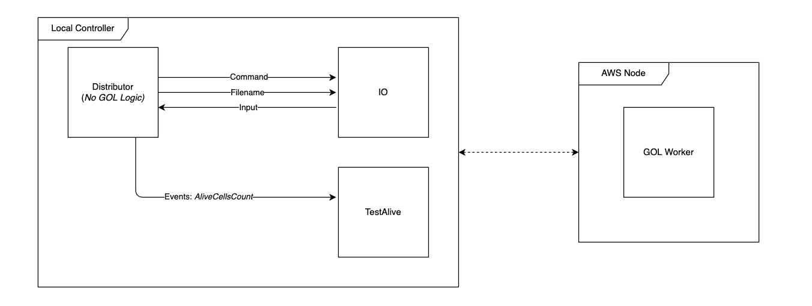
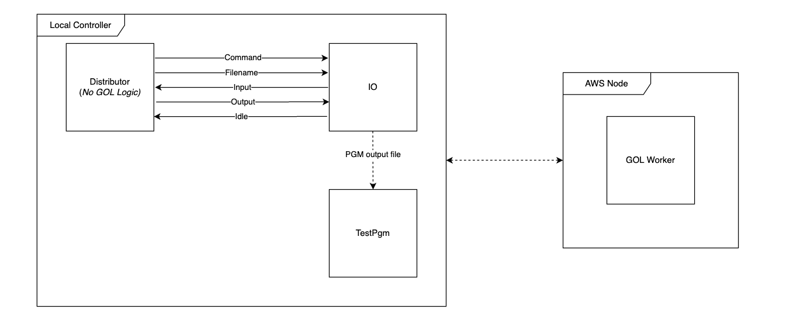
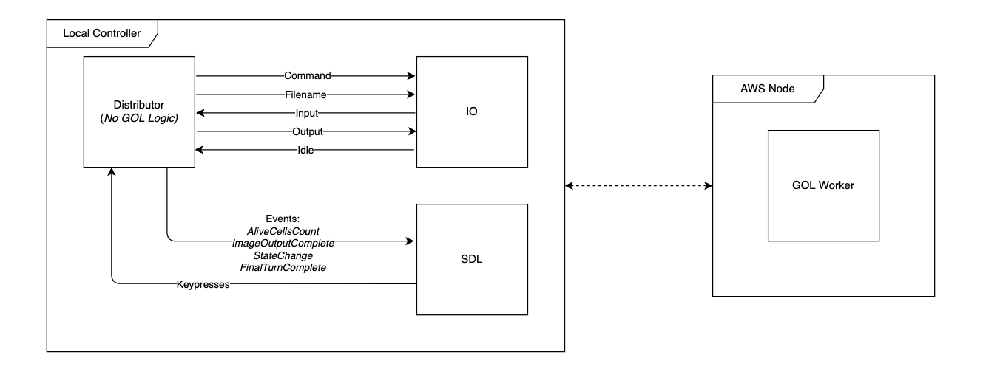

# CSA Coursework: Game of Life

### **Note** : For benchmarking and more in depth information please see [the report](content/report.pdf).

## Task Overview

### Introduction

The British mathematician John Horton Conway devised a cellular automaton named ‘The Game of Life’. The game resides on a 2-valued 2D matrix, i.e. a binary image, where the cells can either be ‘alive’ (pixel value 255 - white) or ‘dead’ (pixel value 0 - black). The game evolution is determined by its initial state and requires no further input. Every cell interacts with its eight neighbour pixels: cells that are horizontally, vertically, or diagonally adjacent. At each matrix update in time the following transitions may occur to create the next evolution of the domain:

- any live cell with fewer than two live neighbours dies
- any live cell with two or three live neighbours is unaffected
- any live cell with more than three live neighbours dies
- any dead cell with exactly three live neighbours becomes alive

Consider the image to be on a closed domain (pixels on the top row are connected to pixels at the bottom row, pixels on the right are connected to pixels on the left and vice versa). A user can only interact with the Game of Life by creating an initial configuration and observing how it evolves. Note that evolving such complex, deterministic systems is an important application of scientific computing, often making use of parallel architectures and concurrent programs running on large computing farms.

The task is to design and implement programs which simulate the Game of Life on an image matrix.

## Stage 2 - Distributed Implementation

In this stage, we create an implementation that uses an o
AWS node to calculate the new state of the Game of Life board,
and communicate state between machines over a network. 

### Step 1

Separate the parallel implementation into two components. One component, the local controller, will be responsible for IO and capturing keypresses. The second component, the GOL Engine, will be responsible for actually processing the turns of Game of Life. 

We start by implementing a basic controller which can tell the logic engine to evolve Game of Life for the number of turns specified in `gol.Params.Turns`. This is achieved by implementing a single, blocking RPC call to process all requested turns.

### Step 2

Report the number of cells that are still alive *every 2 seconds* to the local controller. The controller should then send an `AliveCellsCount` event to the `events` channel. 

### Step 3

The local controller should be able to output the state of the board after all turns have completed as a PGM image. 

### Step 4

Finally, the local controller should be able to manage the behaviour of the GoL engine according to the following rules: 

- If `s` is pressed, the controller should generate a PGM file with the current state of the board.
- If `q` is pressed, close the controller client program without causing an error on the GoL server. A new controller should be able to take over interaction with the GoL engine.
- If `k` is pressed, all components of the distributed system are shut down cleanly, and the system outputs a PGM image of the latest state.
- If `p` is pressed, pause the processing *on the AWS node* and have the *controller* print the current turn that is being processed. If `p` is pressed again resume the processing and have the controller print `"Continuing"`. The keys `q` and `s` to work while the execution is paused.

